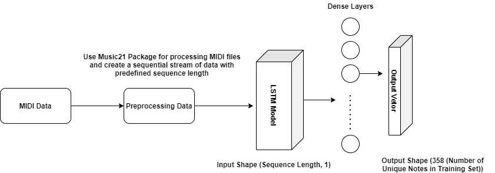

# Music-Generation-Using-Deep-Learning
## Overview
Long Short Term Memory is a Artificial Recurrent Neural Network which is mainly used in time series data.  
The technique used to generate music is same as the technique used to predict the next word in a sentence using LSTM. Here, Instead of predicting the next word, next note is predicted  
The File **Main.ipynb** has the entire pipeline for the project.  
The Directory **models** have the pretrained model.  
The Directory **piano_midi** has the dataset for the training.
## Required Packages
1. Tensorflow 2.X
2. Keras
3. Music21
## Architecture and Pipeline

